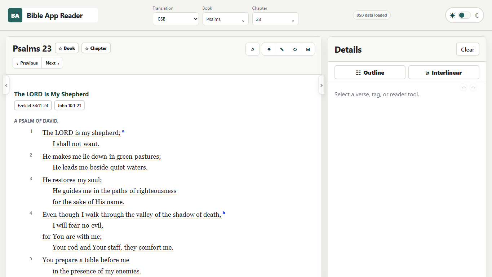
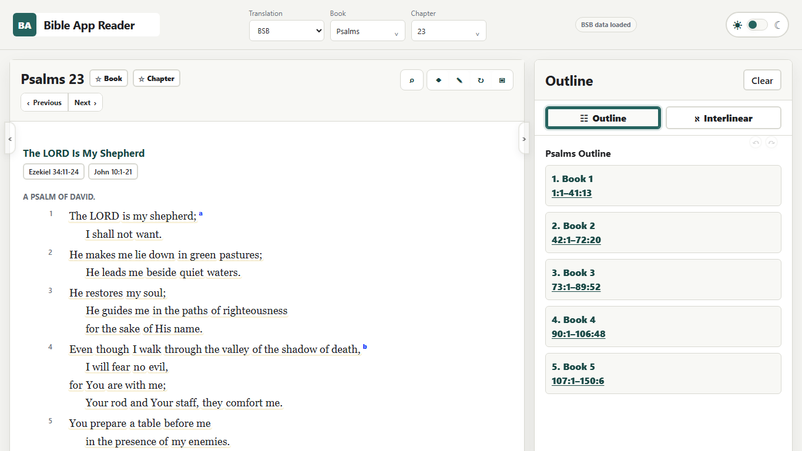
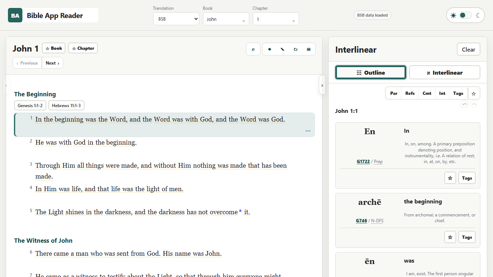
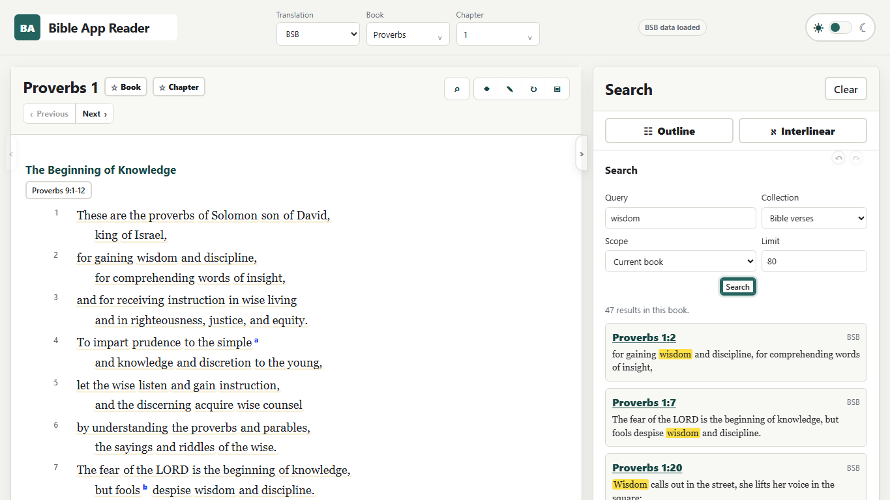
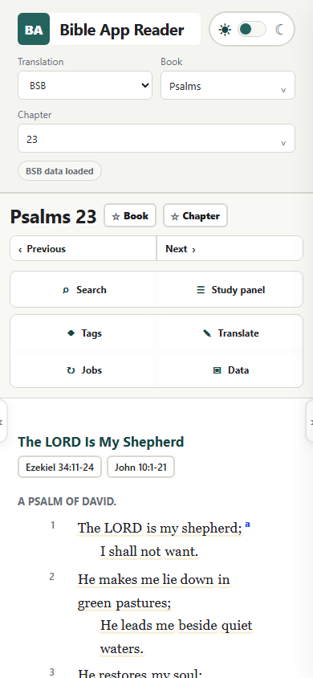

# Bible App Reader

Bible App Reader is a local-first, static Bible study reader with
multi-translation reading, commentary, interlinear analysis, semantic tagging, resilient
browser-local persistence, and desktop/mobile verification.

The app runs entirely as a browser client. Bible texts, commentary, lexicons,
cross-references, interlinear records, search indexes, and generated analysis
packs are shipped as local JSON data, so ordinary study sessions do not require
an account, analytics service, hosted backend, or remote application API.

This repository is intended as a public showcase and source distribution, not
a production SaaS service. Browser-local data does not sync between devices by
itself, and the repository includes large bundled datasets.

## Why This Exists

Bible App Reader is built for structured study without an account or cloud
dependency. It keeps canonical study data local, keeps personal study state in
the browser, and exposes reader, search, interlinear, commentary, tagging, and
data-export tools from one static app.

## Screenshots

| Reader | Detail panel | Interlinear |
| --- | --- | --- |
|  |  |  |

| Search | Mobile |
| --- | --- |
|  |  |

## Features

- Ten English Bible translations with chapter and verse navigation.
- Commentary, outlines, footnotes, cross-references, and Strong's lexicons.
- Hebrew and Greek interlinear views with morphology and language tooltips.
- Local search indexes, semantic tags, favorites, assertions, and study jobs.
- Browser-local persistence with import, export, and recovery coverage.
- Generated word maps and cross-reference graph analysis.
- Static, domain, accessibility, desktop-browser, and mobile-browser tests.

## Public Demo

Prerequisites:

- Node.js 20 or newer
- Python 3 for the local static server
- Microsoft Edge for the browser verification suite

```powershell
npm ci
npm run serve
start http://127.0.0.1:8000/#/read/bsb/psalms/23
```

Routes are hash-based; the default public demo route above opens Psalm 23 in
BSB. The app can also be opened at `http://127.0.0.1:8000/`.

## Verification

```powershell
npm run inventory:check
npm run test:static
npm run test:browser
npm run test:browser:mobile
npm run verify
```

`npm run verify` runs the full static, domain, accessibility, desktop,
mobile, inventory, and package audit suite. The browser tests currently use
Microsoft Edge on Windows. The app should run in modern browsers, but this
repository's automated browser QA is Edge-focused.

Before a public release or tag, also run:

```powershell
npm audit --audit-level=low
gitleaks detect --source . --no-git=false
```

## Testing Strategy

Static tests validate JavaScript/JSON integrity, manifests, capabilities,
analysis packs, interlinear data, UI contracts, reader regressions, morphology,
module singleton boundaries, reference context, tags, accessibility source
coverage, docs consistency, inventory, and publish audit rules. Domain tests
exercise local jobs, package planning/state, poll responses, recovery
scenarios, semantic seeds, and user-data semantics. Browser tests run desktop
and mobile reader flows with Microsoft Edge.

## Architecture

`app/index.html`, `app/app.js`, and `app/styles.css` provide the static shell.
Focused ES modules under `app/src/` implement routing, rendering, study views,
persistence, semantic data, and package state. Runtime datasets live under
`app/data/`; schemas and deterministic data tools live under `app/schemas/`
and `app/tools/`. Repository-level integration and integrity tests are under
`tests/`.

See:

- [Architecture](docs/ARCHITECTURE.md)
- [Data model](docs/DATA_MODEL.md)
- [Security posture](docs/SECURITY_POSTURE.md)
- [Test inventory](tests/TEST_INVENTORY.md)

## Data Rights

Application code, tests, scripts, schemas, and tooling are available under the
MIT License. Bundled Bible and study data retains its source rights and notices
and is not described as MIT-licensed. See [NOTICE.md](NOTICE.md) and
[`app/data/source-manifest.json`](app/data/source-manifest.json).

Some retained notices include both permission/copyright language from the
source package and later public-domain wording for the Berean Study Bible.
Those notices are preserved so downstream users can inspect the provenance
rather than relying on a simplified license summary.

## Accessibility

Static accessibility coverage checks landmarks, labels, button types,
focus-visible styles, reduced-motion support, forced-colors support, RTL
source-text rules, keyboard activation for Strong's/interlinear controls, and
mobile touch equivalents where static inspection is reliable. Browser QA still
matters for visual focus order, zoom behavior, and assistive-technology review.

## Repository Size

The repository includes local runtime datasets for the reader package. The
current package inventory is about 898 MB uncompressed and 169 MB gzipped, so
initial clones and checkouts can be slower than a typical static web project.
A future release could split large data packs into separate release assets.

## Performance Notes

The current showcase keeps large runtime shards in Git so the static app can
run locally without a separate data service. Package inventory and browser
tests are tracked as release gates, but route-level performance budgets remain
future work.

## Known Limitations

- Browser-local data does not automatically synchronize between devices or
  browser profiles.
- The app has no hosted backend, collaborative accounts, or cloud backup.
- Browser verification currently expects Microsoft Edge on Windows.
- Some generated source text contains legacy character-encoding artifacts.
- The bundled data is retained for local-first study use and should be reviewed
  with the included notices before redistribution.
