# Bible App Reader

Bible App Reader is a local-first Bible study workspace that runs as a static
browser application. It combines multi-translation reading, Hebrew and Greek
Language Study, commentary, cross-references, Strong's lexicons, structured
study marks, and portable browser-local data without requiring an account,
hosted backend, analytics service, or remote application API.

The repository is designed as both a public product showcase and an auditable
source distribution. Bible text, original-language records, commentary,
lexicons, search indexes, and generated analysis packs are shipped as local
JSON data so the core study experience remains usable from a plain static
server.

## What Makes It Different

| Capability | Practical value |
|---|---|
| Local-first study | Reading and research do not depend on a hosted service or account. |
| Integrated context | Reader text, commentary, outlines, cross-references, Strong's data, and source-language records remain connected in one workspace. |
| Original-language depth | Hebrew and Greek cards separate source text, transliteration, pronunciation guidance, dictionary form, morphology, glosses, word origin, and related entries. |
| Structured study marks | Favorites and tags can be attached at book, chapter, verse, text-span, and source-token scope. |
| Portable personal data | Browser-local study state can be exported, imported, and recovered as JSON. |
| Auditable package | Source manifests, notices, deterministic data tools, package inventory, and verification scripts are included in the repository. |

## Study Experience

### Reader and navigation

- Ten bundled English Bible translations.
- Book and chapter navigation designed for desktop, narrow, and mobile layouts.
- Sticky verse context while study sections load and expand.
- Footnotes, outlines, commentary, parallel passages, cross-references, and
  verse-scoped actions.
- Reader-to-panel word highlighting and panel history restoration.
- Ordinary prose, headings, superscriptions, poetry, and indentation retain
  their intended presentation.

### Hebrew and Greek Language Study

- Bundled Westminster Leningrad Codex and consonants-only Hebrew records.
- Bundled Nestle 1904 and Scrivener Textus Receptus 1894 Greek records.
- Source text, scholarly transliteration, phonetic spelling, lemma, gloss,
  morphology, Strong's entry, word origin, and related lexical references.
- Hebrew marks and gematria where applicable.
- Greek letter analysis that preserves breathing marks, accents, diaeresis,
  iota subscript, and other attached marks on the displayed glyph.
- Structured Strong's references with contained previews, keyboard and pointer
  access, destination navigation, and Back restoration.
- Lazy verse loading so extended chapter study does not render every card at
  once.

### Study Marks and local data

- One Book mark control and one Chapter mark control, each combining Favorite
  and applicable tags in a target-aware menu.
- Persistent non-favorite badges that remain visible outside closed menus.
- Verse, selected-text, and source-token favorites and tags.
- Canonical semantic targets for books, chapters, verses, ranges, text spans,
  source tokens, and source-token spans.
- Study Marks dashboard for reviewing tagged and favorited targets.
- Study Data tools for browser-local storage, export, import, and recovery.
- Local Processing tools for deterministic study jobs and generated analysis.

### Resilience and accessibility

- IndexedDB startup falls back to localStorage when browser storage is blocked
  or stalls beyond the startup boundary.
- Keyboard-operable study controls and visible focus treatment.
- Pointer, focus, keyboard, and touch support for app-controlled previews.
- Reduced-motion, forced-colors, right-to-left source text, and mobile touch
  coverage where static or browser verification is practical.
- Tooltips and previews are constrained to the visible panel and viewport.

## Screenshots

The gallery uses expandable images so the application can be reviewed directly
from GitHub. PR #15 will refresh the captures after the README rewrite is
complete.

### Reader and Navigation

<details open>
<summary>Reader — Psalm 23</summary>


</details>

<details>
<summary>Book picker — Old and New Testament columns</summary>

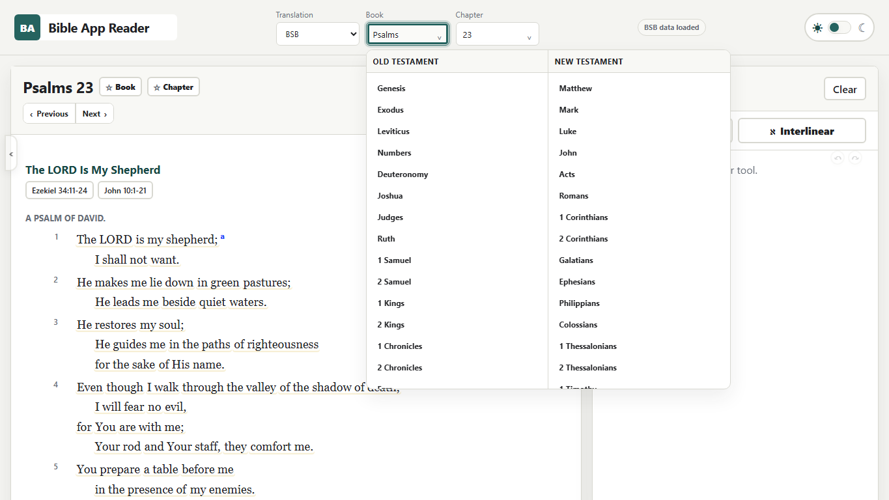

</details>

<details>
<summary>Detail panel — outline and study context</summary>


</details>

<details>
<summary>Verse tools — context tabs and verse actions</summary>

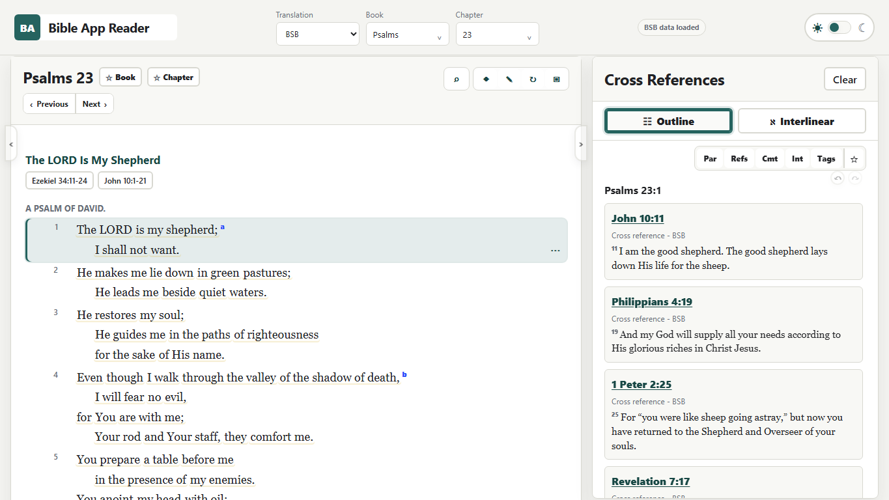

</details>

### Language Study and Strong's

<details open>
<summary>Language Study — source text, Strong's, morphology, and glosses</summary>


</details>

<details>
<summary>Hebrew and Strong's detail panel</summary>

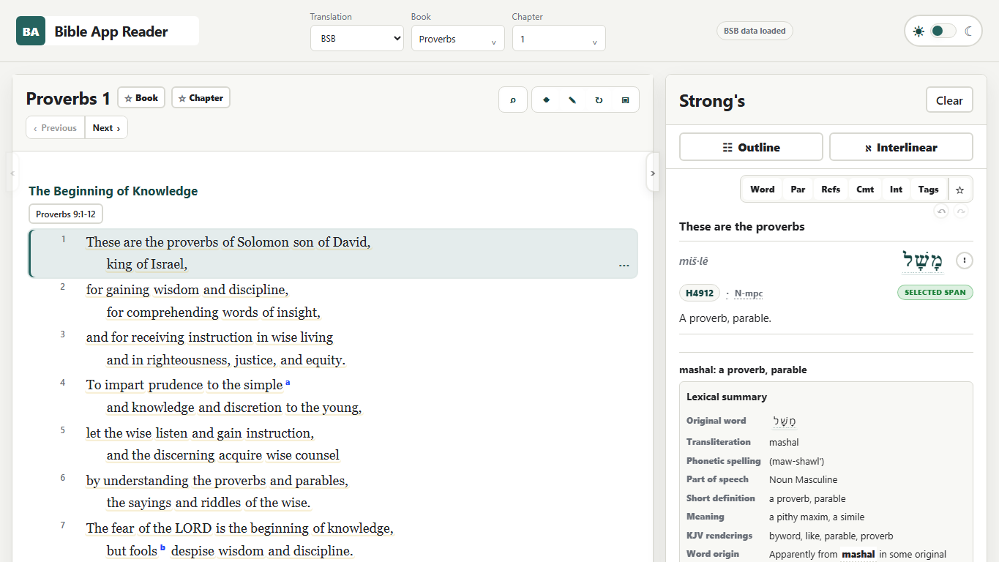

</details>

### Study Workspace

<details>
<summary>Search</summary>


</details>

<details>
<summary>Study Marks</summary>

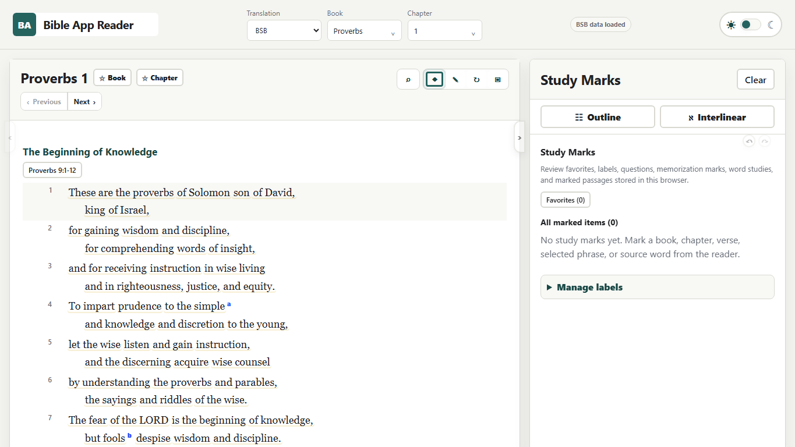

</details>

<details>
<summary>Study Data</summary>

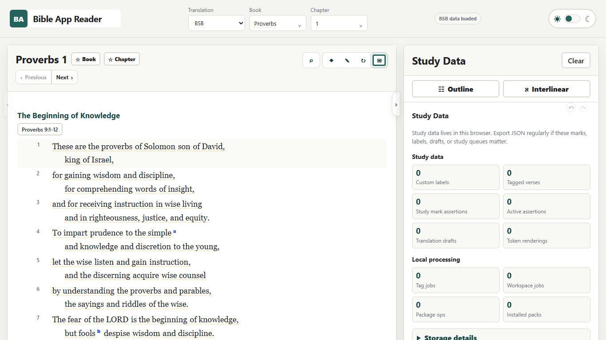

</details>

<details>
<summary>Local Processing</summary>

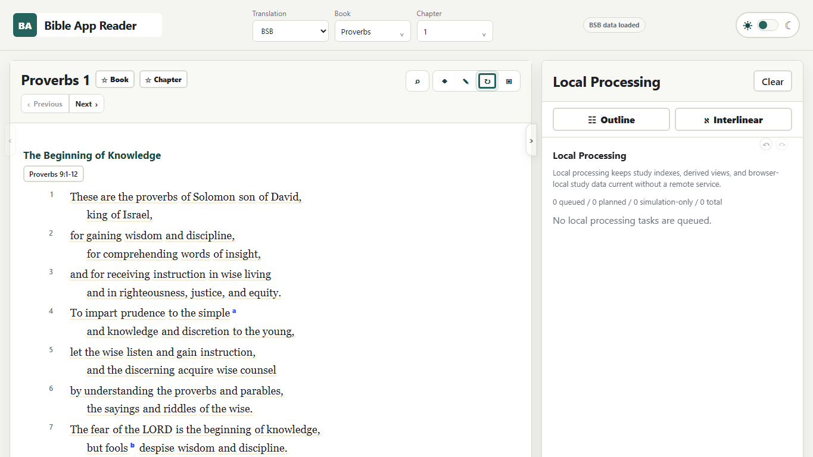

</details>

### Dark Mode

<details open>
<summary>Dark reader — Psalm 23</summary>

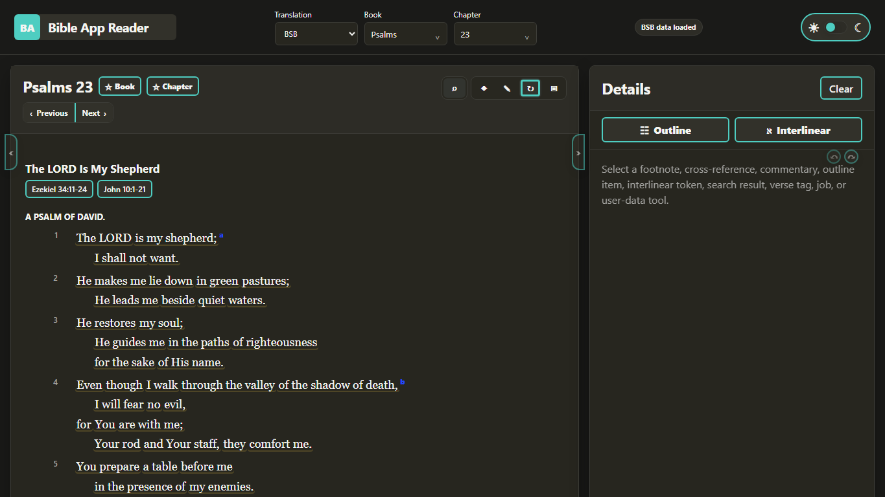

</details>

<details>
<summary>Dark detail panel</summary>

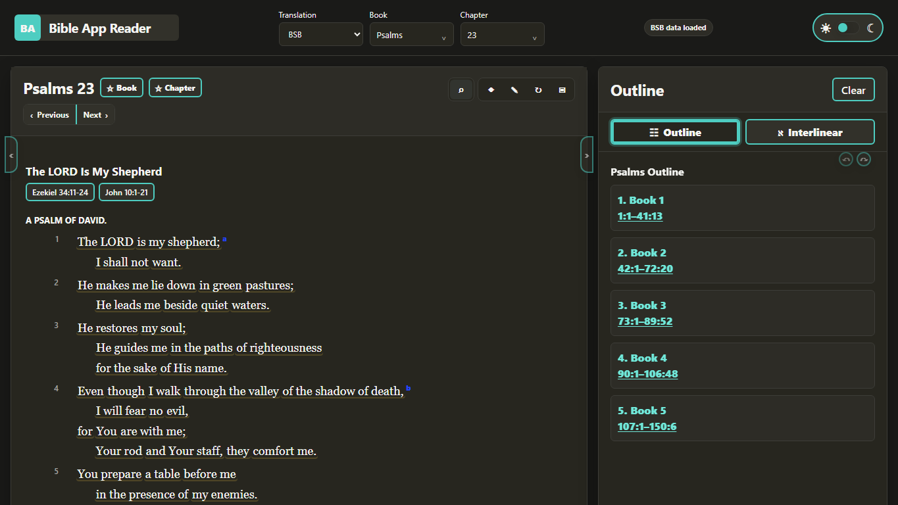

</details>

<details>
<summary>Dark Language Study</summary>

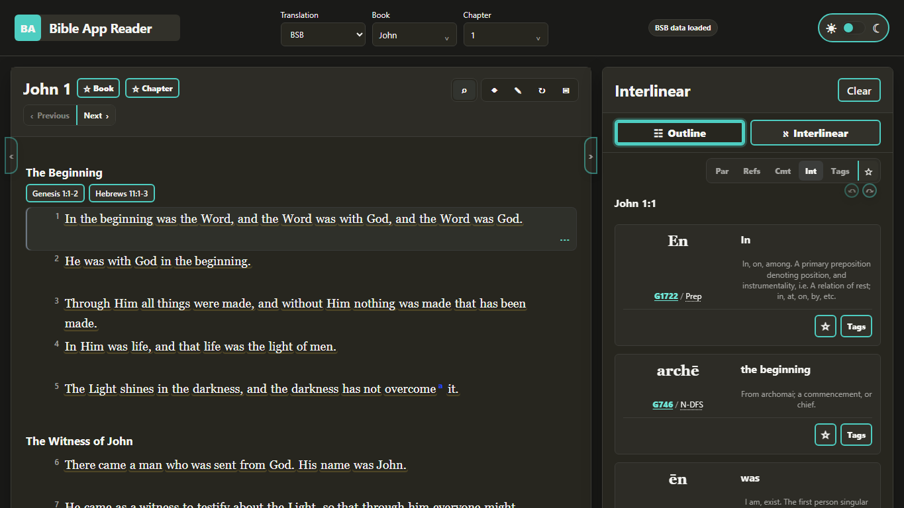

</details>

<details>
<summary>Dark Hebrew and Strong's detail panel</summary>

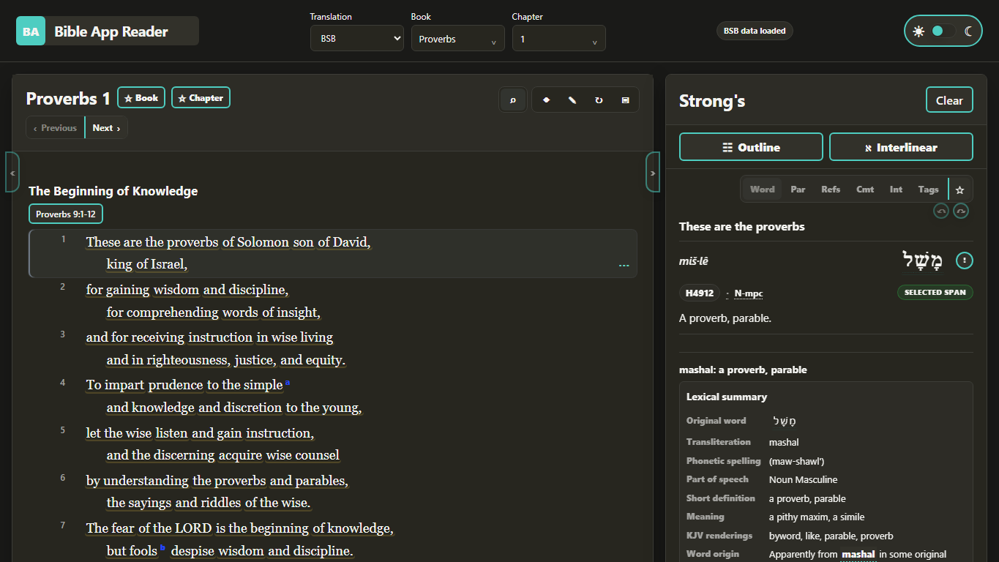

</details>

<details>
<summary>Dark Study Marks</summary>

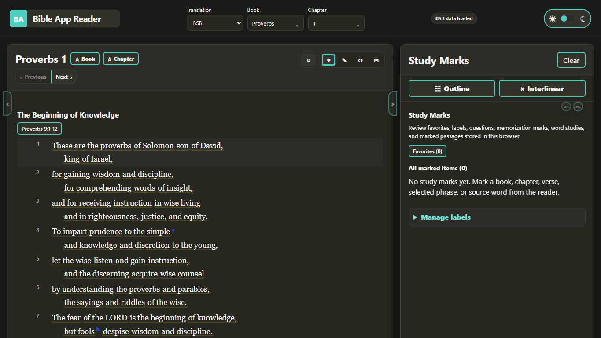

</details>

### Mobile

<details open>
<summary>Mobile reader</summary>


</details>

<details>
<summary>Mobile reader — dark mode</summary>

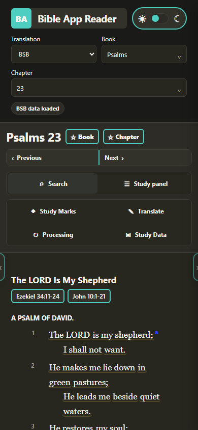

</details>

## Run Locally

### Prerequisites

- Node.js 20 or newer.
- A modern browser.
- Microsoft Edge on Windows only when running the full automated browser suite.

```powershell
npm ci
npm run serve
```

Open:

```text
http://127.0.0.1:8000/#/read/bsb/psalms/23
```

Routes are hash-based, so the app can run from the included Node static server
without a framework-specific deployment runtime. Opening
`http://127.0.0.1:8000/` loads the default application route.

## Verification

```powershell
npm run inventory:check
npm run test:static
npm run test:browser
npm run test:browser:mobile
npm run verify
```

`npm run verify` runs the static, domain, accessibility-source, desktop-browser,
mobile-browser, inventory, and publish-audit suites. The browser automation
currently uses Microsoft Edge on Windows; manual cross-browser work remains
tracked in issue #7.

Before a public release or tag, also run:

```powershell
npm audit --audit-level=low
gitleaks detect --source . --no-git=false
git diff --check
```

See [the test inventory](tests/TEST_INVENTORY.md) for the executable coverage
map.

## Architecture

The application is intentionally deployable as static files:

- `app/index.html`, `app/app.js`, and `app/styles.css` provide the shell.
- Focused ES modules under `app/src/` implement routing, rendering, panel state,
  study tools, semantic targets, persistence, and package state.
- Deterministic runtime datasets live under `app/data/`.
- Schemas and data-generation tools live under `app/schemas/` and `app/tools/`.
- Repository-level integrity and regression tests live under `tests/`.

Hash routing and local JSON shards avoid a required backend while preserving
repeatable routes and deterministic package contents.

Further documentation:

- [Architecture](docs/ARCHITECTURE.md)
- [Data model](docs/DATA_MODEL.md)
- [Security posture](docs/SECURITY_POSTURE.md)
- [UI functionality contract](app/docs/UI_FUNCTIONALITY_SCHEMA.md)
- [Test inventory](tests/TEST_INVENTORY.md)

## Package Inventory and Repository Size

The current full-study package contains:

- 10 reader translations;
- 29 feature packs;
- 2,804 packaged files;
- 954,311,610 aggregate bytes;
- 180,460,807 aggregate gzip bytes.

The repository is therefore much larger than a typical static web project.
Initial clones and checkouts can be slow, but keeping the data together allows
the showcase to run without a hosted data service. Post-public measurement and
data-pack planning remain tracked in issue #6.

## Data Rights

Application code, tests, scripts, schemas, and tooling are available under the
MIT License. Bundled Bible and study data retains its source rights and notices
and is not described as MIT-licensed.

Review:

- [NOTICE.md](NOTICE.md)
- [`app/data/source-manifest.json`](app/data/source-manifest.json)

Some retained source notices contain both permission or copyright language and
later public-domain wording. The repository preserves those notices and the
recorded transformations so downstream users can inspect provenance rather
than rely on an oversimplified license summary.

## Security and Privacy Model

Bible App Reader has no server-side account system, analytics service, payment
flow, remote write API, or application backend. Personal study state remains in
the current browser profile unless the user exports it.

The static application includes a Content Security Policy and sanitizes
commentary HTML, but changes involving HTML rendering, imported data, browser
persistence, or bundled third-party content still require review.

See [SECURITY.md](SECURITY.md) for vulnerability reporting and the current
repository-security posture.

## Current Boundaries

- Browser-local study data does not automatically synchronize across devices or
  browser profiles.
- There is no collaborative account system or cloud backup.
- Automated browser QA is currently Edge-focused; broader manual QA is tracked
  in issue #7.
- The bundled package increases clone and checkout size; future distribution
  options are tracked in issue #6.
- Publication activation, repository settings, and eligible GitHub security
  features remain tracked in issue #5.
- Bundled data should be redistributed only after reviewing the included source
  notices and manifest.

## Project Status

The current public-showcase sequence is:

1. PR #14 — README feature/value rewrite.
2. PR #15 — screenshot refresh.
3. PR #16 — final public-release audit.

Open planning and release issues are deliberately not closed by this README
work:

- #5 — public release activation checklist;
- #6 — post-public data-pack and performance plan;
- #7 — cross-browser public QA pass.

## Contributing

Focused bug reports, documentation corrections, accessibility findings,
data-rights questions, and reproducible browser issues are welcome. See
[CONTRIBUTING.md](CONTRIBUTING.md) before opening a pull request.
